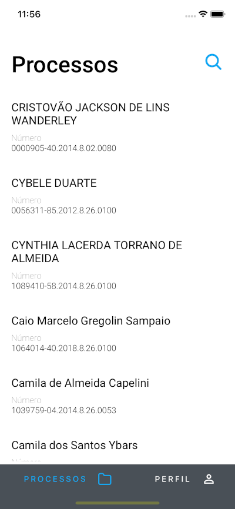
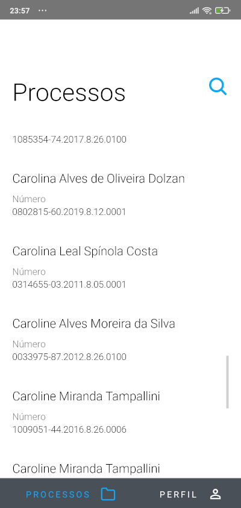

# Exemplo Aplicativo de Processos (React Native & Typescript)
> Aplicativo para consulta de processos judiciais.


 

## Instalação

OS X & Linux:

```sh
git clone https://github.com/STO11/app-proccess.git
```

```sh
cd app-proccess
```

## Configurar variaveis de ambiente

Abra e copie o arquivo `.env.example` criando outro arquivo `.env`

Setando as variaveis  `API_URL` (Seu endpoint) e `API_TOKEN` (chave no header)

Após isso utilize os comandos para rodar sua aplicação:

Para ANDROID:
```sh
npx react-native run-android
```

Para IOS:
```sh
npx react-native run-ios
```
## Autenticação no aplicativo

Para logar no app utilize usuário `candidato_mobile@email.com.br`  e senha `123456`
